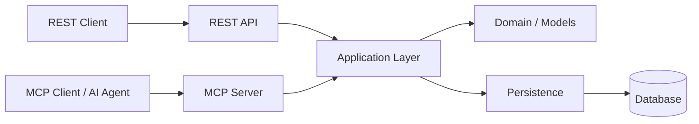

# Server Hub

**A Python service exposing the same server-management capabilities through REST and Model Context Protocol (MCP).**

Server Hub provides two interface boundaries over the same underlying application capabilities:

- **REST API**, implemented with FastAPI
- **MCP server**, providing tools for MCP-aware clients and AI agents

The goal is simple: keep application behavior independent from the transport or client consuming it.

---

## See MCP orchestration in action

The integrated **MCP Playground** makes the interaction between an LLM and MCP visible.

In the example below, a user asks an LLM to identify production servers requiring attention. The LLM discovers and invokes MCP tools, receives their results, reasons over the returned information, and continues the interaction until it can produce the final analysis.

The Playground makes the complete process observable:

- LLM ↔ MCP communication
- MCP tool discovery
- Tool requests and responses
- Iterative LLM/tool execution
- Per-operation timing
- MCP activity and payloads
- Final LLM response
- Execution summary

https://github.com/user-attachments/assets/237aa741-6063-49be-b4b3-5fe50bc24773

---

## Why MCP?

The same application capability can be consumed through different interfaces.

A REST client explicitly invokes an HTTP operation. An MCP-aware client can discover the available capabilities as tools and allow an LLM to decide which tools are relevant to a user's request.

For example, a request such as:

> Which production servers require attention?

can result in an iterative sequence of MCP tool calls such as:

```text
search_servers
      ↓
get_server
      ↓
get_server_metrics
      ↓
get_active_alerts
      ↓
final LLM response
```

The important part is that the application logic does not need to know whether the request originated from a REST client, an MCP client, or an AI agent.

---

## Architecture



REST and MCP are interface boundaries around the application layer. Persistence details remain behind that boundary.

This separation keeps the business/application behavior independent from transport protocols and prevents the MCP layer from becoming a second implementation of the same functionality.

---

## MCP tools

The MCP interface currently exposes:

| Tool | Purpose |
|---|---|
| `search_servers` | Search for servers by partial name or IP address |
| `get_server` | Retrieve detailed information about a server |
| `get_server_metrics` | Retrieve recent metrics for a server |
| `get_active_alerts` | Retrieve active operational alerts |
| `get_system_stats` | Retrieve system-level statistics |
| `create_alert` | Create an operational alert |

The MCP layer maps internal application data into client-oriented responses rather than exposing persistence implementation details.

---

## REST API

The REST interface provides equivalent application capabilities through HTTP, including:

- Server discovery and lookup
- Server status
- Server metrics
- Active alerts
- Alert creation
- System statistics

REST and MCP intentionally expose equivalent capabilities without requiring their response envelopes to be identical.

---

## REST ↔ MCP equivalence

One of the project's design goals is that REST and MCP should represent **the same application capabilities**, rather than two independently implemented versions of the system.

The test suite includes an explicit equivalence layer that verifies this relationship.

```text
REST request ──────┐
                   ├──> Application Layer
MCP tool call ─────┘
```

This makes the transport boundary testable while keeping domain/application behavior shared.

---

## MCP Playground

The Playground is served as part of Server Hub rather than requiring a separate Playground server.

It provides a browser-based environment for testing the MCP integration with an LLM.

### LLM connection

The user can configure the LLM connection with:

- Provider
- Base URL
- API key
- Model

Provider presets make it possible to switch between compatible LLM endpoints without changing the application.

### MCP connection

Once connected, the Playground discovers the MCP tools and displays the number of available tools.

The connection configuration can be collapsed while remaining editable.

### Execution trace

When a question is submitted, the Playground exposes the orchestration steps:

```text
Asking LLM
✓ LLM response received · <elapsed>

LLM requested tool calling <tool>
✓ Tool calling response received · <elapsed>

Informing LLM
✓ LLM response received · <elapsed>

...

✓ Final LLM response received
```

This makes otherwise hidden LLM/MCP interactions visible and provides timing for the actual LLM and MCP operations.

---

## Testing

Run the complete test suite with:

```bash
pytest -q
```

The repository includes separate tests for the public interfaces and a REST ↔ MCP equivalence suite:

```text
tests/
├── test_api.py
├── test_mcp.py
└── test_rest_mcp_equivalence.py
```

The equivalence tests verify that the REST and MCP interfaces expose equivalent capabilities and data without requiring their response envelopes to be identical.

---

## Project structure

```text
app/
├── api/
│   ├── domain/
│   ├── routes/
│   └── ...
├── mcp/
└── ...

tests/
docs/
scripts/
```

The implementation is organized around application/domain logic and interface adapters.

Architecture documentation and Architecture Decision Records (ADRs) are available under [`docs/`](docs/).

---

## Development

Create a virtual environment and install the project dependencies:

```bash
python -m venv .venv
source .venv/bin/activate
pip install -e ".[test]"
```

Run the test suite:

```bash
pytest -q
```

The repository also contains scripts/components for running the REST and MCP services locally.

---

## Design principles

The project follows a few deliberately simple principles:

- **Shared application behavior** — REST and MCP should not duplicate business logic.
- **Transport independence** — application behavior should not depend on REST or MCP.
- **Interface adapters** — REST and MCP are boundaries around the application layer.
- **Persistence isolation** — persistence details remain behind the application boundary.
- **Meaningful MCP operations** — MCP-facing tools use domain-oriented identifiers and operations.
- **Test semantic equivalence** — public interfaces are tested for equivalent capabilities and data.

---

## Documentation

Additional architecture material and Architecture Decision Records are available in [`docs/`](docs/).

---

## License

This project is licensed under the MIT License. See [`LICENSE`](LICENSE) for details.
