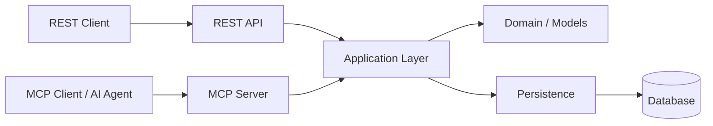

# Server Hub

**Server Hub is a Python service that exposes server-management and operational capabilities through both REST and Model Context Protocol (MCP).**

The project deliberately keeps application behavior independent from the interface used to consume it:

```text
REST Client ───────┐
                   ├──> Application Layer ──> Persistence
MCP Client / Agent ┘
```

The repository also includes an integrated **MCP Playground** that makes LLM ↔ MCP orchestration visible in the browser.

---


## See MCP orchestration in action

The integrated **MCP Playground** makes the interaction between an LLM and MCP visible.

In the example below, a user asks an LLM to identify production servers requiring attention. The LLM discovers and invokes MCP tools, receives their results, reasons over the returned information, and continues the interaction until it can produce the final analysis.

The Playground makes the complete process observable:

- LLM ↔ MCP communication
- MCP tool discovery
- Tool requests and responses
- Iterative LLM/tool execution
- Per-operation timing
- MCP activity and payloads
- Final LLM response
- Execution summary

https://github.com/user-attachments/assets/237aa741-6063-49be-b4b3-5fe50bc24773


## Why this project exists

A traditional REST API requires the client to know which operation to call and how to compose multiple operations.

MCP introduces a different interaction model: an MCP-aware client can discover available capabilities as tools and allow an LLM to decide which tools are relevant to a user's request.

For example:

> Which production servers require attention?

may result in an interaction such as:

```text
User
  │
  ▼
LLM
  │
  ├── search_servers
  │       ↓
  ├── get_server
  │       ↓
  ├── get_server_metrics
  │       ↓
  ├── get_active_alerts
  │       ↓
  └── final response
```

The important architectural property is that **the application does not need to know whether a request originated from REST, MCP, or an AI agent**.

---

## Architecture



REST and MCP are interface boundaries around the application layer.

This separation provides:

- shared application behavior;
- transport independence;
- less duplicated business logic;
- isolated persistence details;
- independently testable interfaces.

The MCP layer is responsible for translating application capabilities into client-oriented tools and responses rather than exposing database implementation details.

---

# MCP interface

The current MCP interface exposes six operational tools:

| Tool | Purpose |
|---|---|
| `search_servers` | Search for servers by partial name or IP address |
| `get_server` | Retrieve detailed information for one server |
| `get_server_metrics` | Retrieve recent metrics for a server |
| `get_active_alerts` | Retrieve currently active alerts |
| `get_system_stats` | Retrieve aggregate system statistics |
| `create_alert` | Create an operational alert |

The tool set is intentionally small and composable. The goal is to expose meaningful operational capabilities rather than mirror every database or REST operation.

### MCP-facing identity

MCP clients do not need to know persistence IDs.

Server-oriented tools use meaningful identifiers such as:

```text
web-server-01
192.168.1.10
```

The MCP/application boundary resolves these identifiers to internal records.

### Search semantics

`search_servers` supports partial matching by server name or IP address and can be used for fleet discovery.

A typical multi-server workflow can therefore be composed as:

```text
search_servers
      ↓
discover relevant servers
      ↓
get_server_metrics
      ↓
compare observations
```

### Response boundary

Internal persistence objects and MCP-facing responses are deliberately different.

The MCP layer sanitizes responses so that database-specific implementation details do not become part of the LLM context.

---

# REST API

The REST interface exposes the same underlying application capabilities through HTTP, including:

- server discovery and lookup;
- server status;
- server metrics;
- active alerts;
- alert creation;
- system statistics.

REST and MCP are intentionally equivalent at the **capability/data level**, without requiring identical response envelopes.

---

# REST ↔ MCP equivalence

One of the project's core design goals is that REST and MCP should represent the same application capabilities rather than become two independent implementations.

Conceptually:

```text
REST request ──────┐
                   ├──> Application Layer
MCP tool call ─────┘
```

The repository includes an explicit REST ↔ MCP equivalence test layer to verify this relationship.

---

# MCP Playground

The repository includes an integrated browser-based **MCP Playground** for exploring and debugging LLM ↔ MCP interactions.

It provides:

- configurable LLM and MCP connections;
- MCP tool discovery;
- iterative LLM tool calling;
- communication and MCP activity traces;
- execution metrics.

The Playground is documented separately in [`playground/README.md`](playground/README.md).

For the complete Playground architecture, execution state, UI behavior, export format, configuration, and usage details, see the [Playground README](playground/README.md).

---


# Error handling and resilience

Errors are surfaced according to where they occur:

- LLM connection status;
- MCP connection status;
- communication trace;
- MCP activity trace;
- assistant response area;
- debug protocol log.

Failed MCP tool calls remain part of the execution record with their duration, arguments, and error information. This allows failed runs to remain useful for diagnosis and export.

The MCP implementation has also been validated for:

- initialization;
- tool discovery;
- invalid inputs;
- unknown servers;
- repeated calls;
- reconnect after restart;
- multiple clients;
- concurrent alert writes;
- LLM tool selection;
- multi-tool reasoning;
- fleet-wide metric comparison;
- alert correlation.

---

# Testing

Run the complete test suite with:

```bash
pytest -q
```

The repository includes separate tests for the public interfaces and a REST ↔ MCP equivalence suite:

```text
tests/
├── test_api.py
├── test_mcp.py
└── test_rest_mcp_equivalence.py
```

The equivalence tests verify that REST and MCP expose equivalent capabilities and data without requiring their response envelopes to be identical.

Additional MCP integration and validation scripts are available in the repository.

---

# Project structure

The project is organized around application/domain logic and interface adapters.

A simplified structure is:

```text
app/
├── api/
│   ├── domain/
│   ├── routes/
│   └── ...
├── mcp/
└── ...

playground/
├── index.html
├── style.css
├── app.js
└── README.md

tests/
docs/
scripts/
```

## Main areas

### `app/`

Application, domain, REST, MCP, and persistence-related implementation.

### `playground/`

The browser-based MCP/LLM Playground.

- `index.html` — Playground UI structure.
- `style.css` — Playground styling and responsive layout.
- `app.js` — LLM/MCP orchestration, execution state, tracing, metrics, Markdown rendering, and export.
- `README.md` — Playground-specific documentation.

### `tests/`

Automated tests covering REST, MCP, and interface equivalence.

### `docs/`

Architecture documentation and Architecture Decision Records.

### `scripts/`

Operational and integration scripts used during development and validation.

---

# Development

Create a virtual environment:

```bash
python -m venv .venv
source .venv/bin/activate
```

Install the project with test dependencies:

```bash
pip install -e ".[test]"
```

Run the tests:

```bash
pytest -q
```

The repository also contains scripts/components for running the REST and MCP services locally.

The Playground is served as part of the application and references:

```html
<link rel="stylesheet" href="/playground/style.css" />
<script src="/playground/app.js"></script>
```

---

# Design principles

The project follows a small set of architectural principles:

### Shared application behavior

REST and MCP should consume the same application capabilities rather than duplicate business logic.

### Transport independence

Application behavior should not depend on REST, MCP, or a specific client.

### Interface adapters

REST and MCP are boundaries around the application layer.

### Persistence isolation

Persistence implementation details remain behind the application boundary.

### Meaningful MCP operations

MCP tools should expose operations and identifiers that make sense to clients and LLMs.

### Measured execution

The Playground prefers actual measured durations and provider-reported usage over estimates.

### Observable orchestration

LLM/MCP interactions should be visible enough to understand how a final answer was produced.

### Centralized execution state

A completed run should have a coherent execution record that can support both the UI and export.

### Preserve failures

Failures are useful diagnostic information and should remain visible in the execution record rather than being discarded.

---

# Documentation

Additional project documentation is available under:

```text
docs/
```

Relevant architectural material includes the MCP design and validation documentation, including the MCP v1 validation work and the project architecture/decision records.

The Playground also has its own detailed documentation in:

```text
playground/README.md
```

---

# Current status

The project currently provides:

- a REST API;
- an MCP server;
- shared application capabilities behind both interfaces;
- REST ↔ MCP equivalence testing;
- MCP tool validation and resilience testing;
- an integrated LLM/MCP Playground;
- iterative LLM ↔ MCP tool orchestration;
- execution metrics and tracing;
- Markdown execution export.

The Playground is currently at **v0.7.7**.

---

# License

No license is specified in the current project materials.
