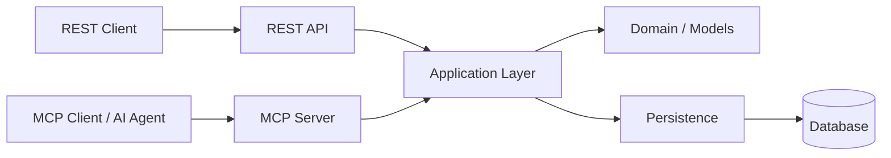

# Server Hub

Server Hub is a Python service that exposes server-management and operational data through two interfaces:

- **REST API**, implemented with FastAPI
- **MCP server**, providing tools for MCP-aware clients and AI agents

Both interfaces are intended to expose the same underlying application capabilities rather than duplicate business logic.

## See MCP orchestration in action

The MCP Playground makes the interaction between an LLM and MCP visible.

In this example, the user asks the LLM to identify production servers
requiring attention. The LLM discovers and invokes MCP tools, receives their
results, reasons over the returned information, and continues the
conversation until it can produce the final analysis.

The Playground exposes the entire process in real time, including:

- LLM ↔ MCP communication
- Tool discovery and invocation
- Tool inputs and results
- Iterative LLM/tool execution
- Per-operation timing
- Final LLM response
- Execution summary

<!-- Upload playground.mp4 to GitHub and replace this URL -->
https://github.com/user-attachments/assets/237aa741-6063-49be-b4b3-5fe50bc24773

## Architecture



REST and MCP are interface boundaries around the application layer. Persistence details remain behind that boundary.

## MCP tools

The MCP interface exposes:

- `search_servers`
- `get_server`
- `get_server_metrics`
- `get_active_alerts`
- `get_system_stats`
- `create_alert`

The MCP layer maps internal application data into client-oriented responses rather than exposing persistence implementation details.

## REST API

The REST interface provides operations for:

- server discovery and lookup
- server status
- server metrics
- active alerts
- alert creation
- system statistics

## Testing

Run the complete test suite with:

```bash
pytest -q
```

The repository includes separate tests for the public interfaces and a REST ↔ MCP equivalence suite.

```text
tests/
├── test_api.py
├── test_mcp.py
└── test_rest_mcp_equivalence.py
```

The REST ↔ MCP equivalence tests verify that the two interfaces expose equivalent capabilities and data without requiring their response envelopes to be identical.

## Project structure

```text
app/
├── api/
│   ├── domain/
│   ├── routes/
│   └── ...
├── mcp/
└── ...

tests/
docs/
```

The implementation is organized around application/domain logic and interface adapters.

## Documentation

Architecture documentation and Architecture Decision Records (ADRs) are available under `docs/`.

## Development

Create a virtual environment, install the project dependencies, and run the tests:

```bash
python -m venv .venv
source .venv/bin/activate
pip install -e ".[test]"
pytest -q
```

The repository also contains scripts/components for running the REST and MCP services locally.

## Design principles

- Keep application behavior independent from transport protocols.
- Treat REST and MCP as interface adapters.
- Keep persistence details behind the application boundary.
- Prefer meaningful domain identifiers in MCP-facing operations.
- Test public interfaces and their semantic equivalence.

## License

This project is licensed under the MIT License. See [LICENSE](LICENSE) for details.
