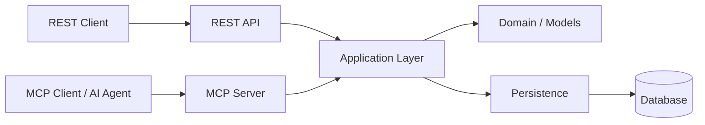

# Server Hub

**Server Hub is a Python service that exposes server-management and operational capabilities through both REST and Model Context Protocol (MCP).**

The project separates application behavior from the interfaces used to consume it, allowing REST clients, MCP clients, and AI agents to work with the same underlying capabilities.

---

# Architecture

Server Hub separates interface concerns from application behavior. REST and MCP act as interface boundaries around shared application capabilities, which in turn interact with persistence.



Conceptually:

```text
REST Client ──→ REST API ──┐
                           ├──→ Application Layer ──→ Persistence
MCP Client ──→ MCP Server ─┘
```

This separation provides:

- shared application behavior;
- transport independence;
- reduced duplication of business logic;
- persistence isolation;
- independently testable interfaces.

---

# MCP Server

The MCP server exposes operational capabilities as tools that MCP-aware clients and AI agents can discover and invoke.

## Available tools

| Tool | Purpose |
|---|---|
| `search_servers` | Search for servers by partial name or IP address |
| `get_server` | Retrieve detailed information for one server |
| `get_server_metrics` | Retrieve recent metrics for a server |
| `get_active_alerts` | Retrieve currently active alerts |
| `get_system_stats` | Retrieve aggregate system statistics |
| `create_alert` | Create an operational alert |

The MCP interface is intentionally focused on meaningful operational capabilities rather than exposing persistence implementation details.

## Server identification

MCP-facing operations use meaningful server identifiers such as:

```text
web-server-01
192.168.1.10
```

The application layer resolves these identifiers to internal records.

## Tool discovery

MCP clients can initialize a session and discover the available capabilities through the standard MCP tool-discovery flow.

---

# REST API

The REST interface exposes the application's server-management and operational capabilities through HTTP.

The API includes capabilities for:

- server discovery and lookup;
- server status and details;
- server metrics;
- active alerts;
- alert creation;
- aggregate system statistics.

REST is an interface to the same application capabilities used by MCP rather than a separate implementation of the business logic.

---

# REST ↔ MCP

REST and MCP are two interfaces over the same application capabilities.

```text
REST request ──┐
               ├──→ Application Layer
MCP tool call ─┘
```

The project includes explicit REST ↔ MCP equivalence tests to verify that the two interfaces expose equivalent capabilities and data while allowing their response envelopes to remain interface-specific.

The objective is to keep the application behavior consistent regardless of whether a capability is reached through HTTP or MCP.

---

# MCP Playground

Server Hub includes an integrated **MCP Playground** for exploring and observing LLM ↔ MCP interactions.

The Playground provides a visual environment where an LLM can discover and invoke MCP tools, while the interaction between the LLM and MCP server is made visible through the execution flow and tool activity.

For complete documentation, configuration, usage, and implementation details, see the [MCP Playground README](playground/README.md).

## Demo

The following video demonstrates the Playground in action, showing an LLM interacting with the MCP server through tool discovery and execution:

<!-- https://github.com/user-attachments/assets/237aa741-6063-49be-b4b3-5fe50bc24773 -->
https://github.com/user-attachments/assets/97d4fb0d-9989-4ad6-a072-119335ba26d0

---

# Project Structure

The project is organized around the application, interface adapters, tests, documentation, and supporting development resources.

```text
app/
├── api/
├── mcp/
└── ...

playground/
└── ...

tests/
docs/
scripts/
```

The Playground has its own documentation and is intentionally documented separately from the main project.

---

# Testing

The project includes automated tests for the REST and MCP interfaces and for their equivalence.

Run the test suite with:

```bash
pytest -q
```

The main test areas include:

```text
tests/
├── test_api.py
├── test_mcp.py
└── test_rest_mcp_equivalence.py
```

Additional integration and validation material is maintained in the repository's supporting test and script resources.

---

# Development

Create a virtual environment:

```bash
python -m venv .venv
source .venv/bin/activate
```

Install the project with test dependencies:

```bash
pip install -e ".[test]"
```

Run the tests:

```bash
pytest -q
```

The repository contains the application components and supporting resources required to run and validate the REST and MCP services locally.

---

# Documentation

Additional project documentation is available under:

```text
docs/
```

The repository also contains Architecture Decision Records and other architectural material.

For Playground-specific documentation, see:

[`playground/README.md`](playground/README.md)

The Playground README is the authoritative documentation for the Playground's configuration, usage, UI, execution behavior, and implementation details.

---

# Design Principles

### Shared application behavior

REST and MCP consume the same application capabilities rather than maintaining separate business logic.

### Transport independence

Application behavior should not depend on whether the request arrived through REST or MCP.

### Interface adapters

REST and MCP act as boundaries around the application layer.

### Persistence isolation

Persistence implementation details remain behind the application boundary.

### Meaningful MCP operations

MCP tools expose operational capabilities and identifiers that are useful to clients and AI agents.

---

# Current Status

Server Hub currently provides:

- a REST API;
- an MCP server;
- shared application capabilities behind both interfaces;
- REST ↔ MCP equivalence testing;
- an integrated MCP Playground for exploring LLM/MCP interactions.

The Playground is maintained as a separate documented component within the project.

---

# License

No license is currently specified in the project materials.
