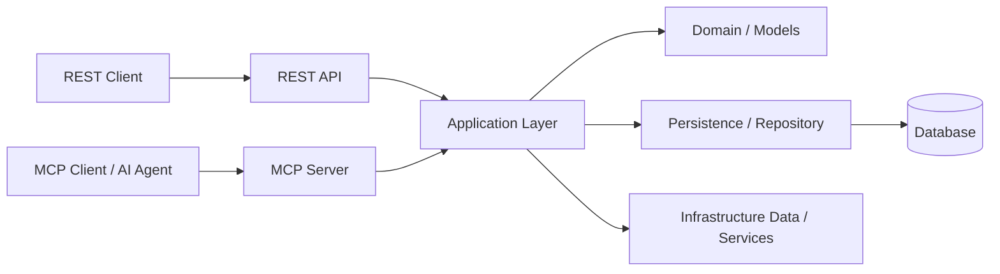
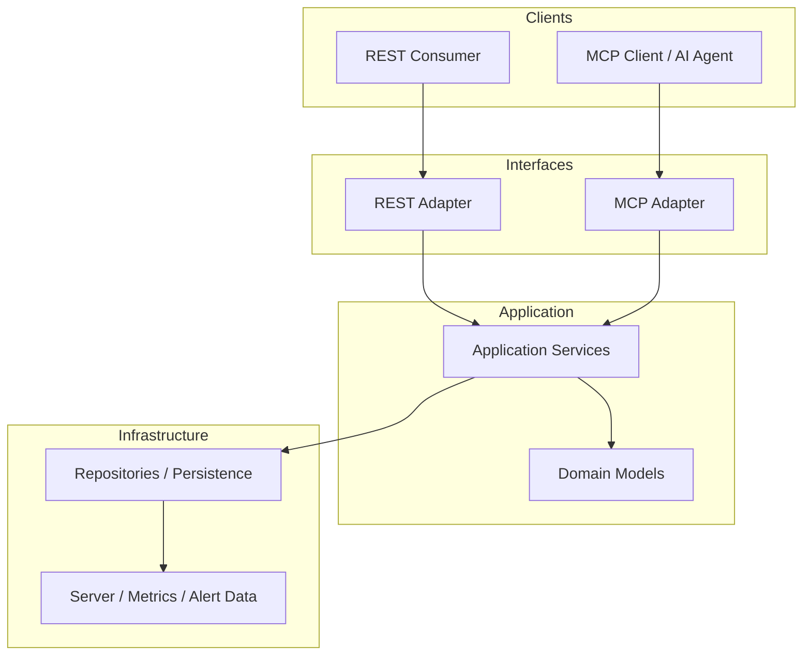
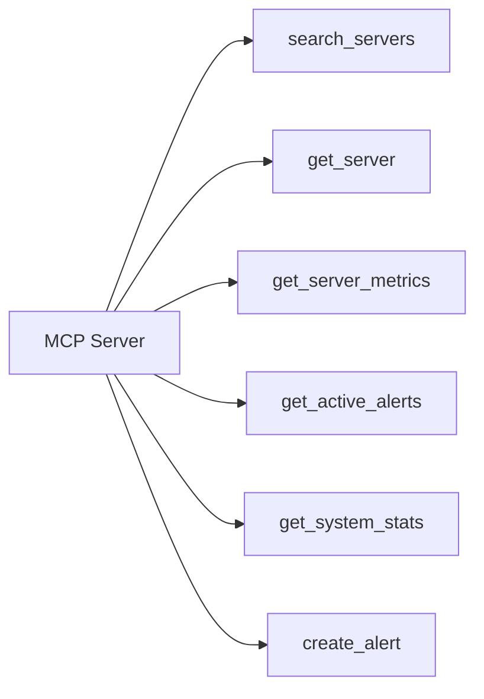

# Architecture

## System Context

Server Hub exposes the same operational capabilities through two public interfaces:
REST and MCP.

## Interface Architecture

The REST and MCP interfaces are adapters over the same application capabilities.

## MCP Tool Surface

The MCP adapter exposes the following six tools:

## Architectural Principles

- REST and MCP are interface adapters, not separate business-logic implementations.
- Application capabilities are shared by both interfaces.
- Persistence details remain behind the application boundary.
- MCP responses expose sanitized, client-oriented representations.
- REST ↔ MCP equivalence tests verify that both interfaces expose equivalent capabilities and data.

## Related Documentation

- `docs/adr/0001-mcp-as-interface-adapter.md`
- `docs/adr/0002-hide-persistence-details.md`
- `tests/test_api.py`
- `tests/test_mcp.py`
- `tests/test_rest_mcp_equivalence.py`
